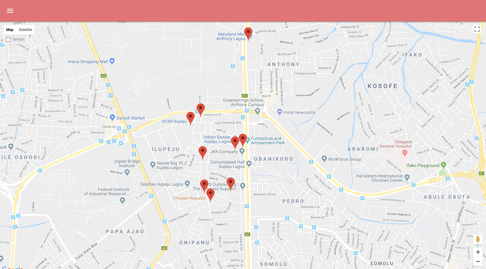
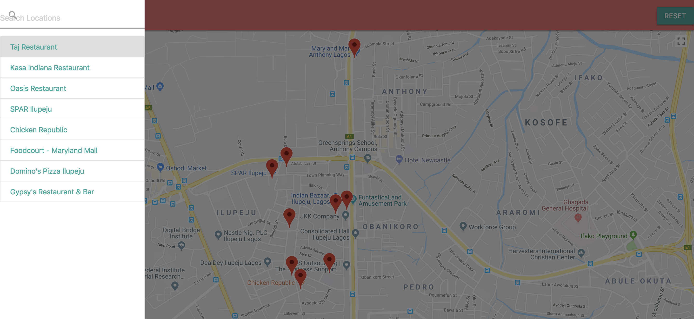
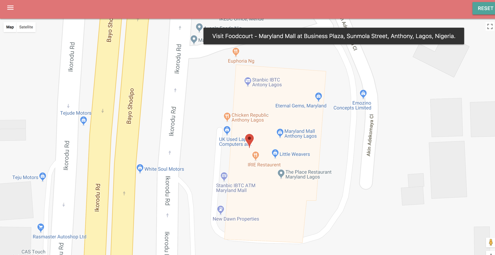

# FSND Project: Neighborhood Map

#### by Omotayo Madein
---

## Description

This is a project for [Udacity Full Stack Web Developer Nanodegree](https://www.udacity.com/course/full-stack-web-developer-nanodegree--nd004). The Neighbour Map project highlights a single page application that is complex enough and incorporates a map view, search function and a variety of data points. It implements the following frameworks, libraries and APIs:

* [Knockout.js](http://knockoutjs.com/)
* [Materialize CSS](https://materializecss.com/)
* [Google Maps API](https://developers.google.com/maps/)
* [Geocode API](https://developers.google.com/maps/documentation/javascript/geocoding)
* [NYTimes API](https://developer.nytimes.com/)
* [Material Icon](https://material.io/tools/icons/)

## Requirements

* A browser and internt access

## Project Content

* `css/` - contains library styles and custom styles
* `js/` - contains files that support the rendering of `index.html`
* `index.html` - Main page displayed by browser.

## How To Run

* Step 0: Clone this repo to your desktop
    `git clone https://github.com/tayomadein/neighborhood-map.git`

* Step 1: Open `index.html` in your browser

### OR

* Step 0: View a live version of this site [here](https://tayomadein.github.io/neighborhood-map/)

### Screenshots

